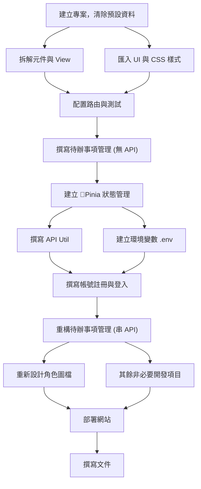
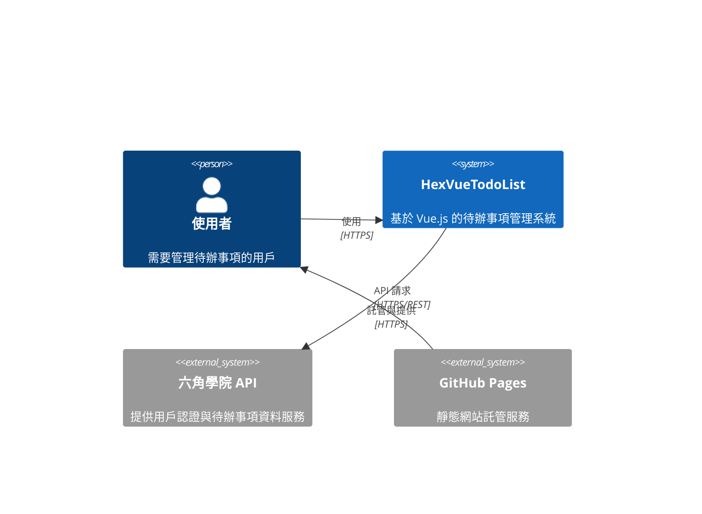
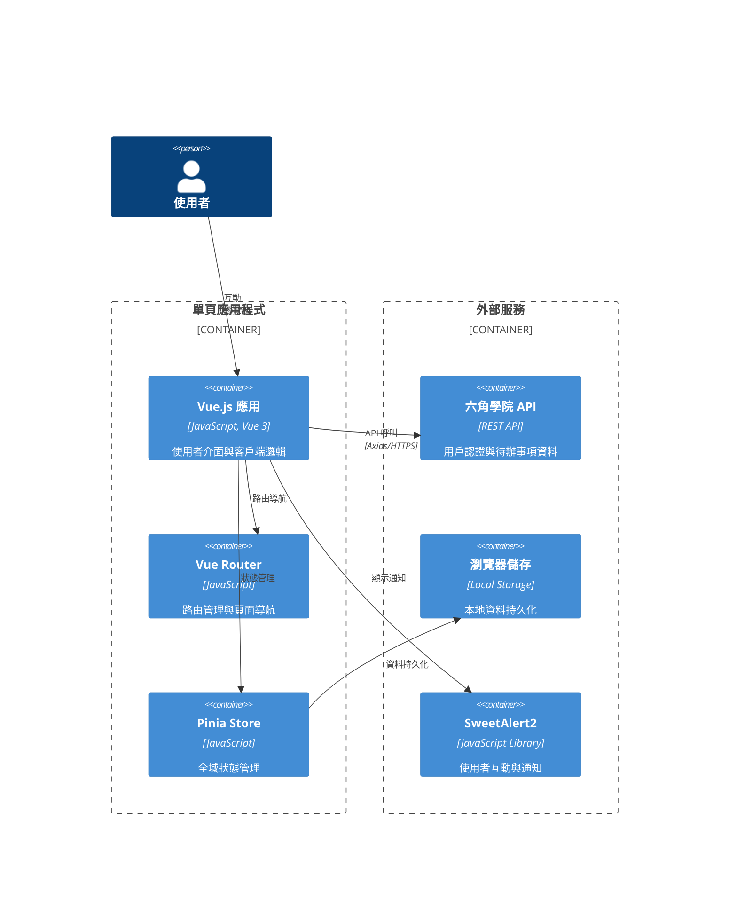
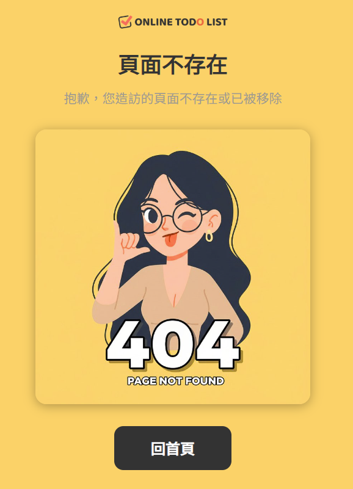
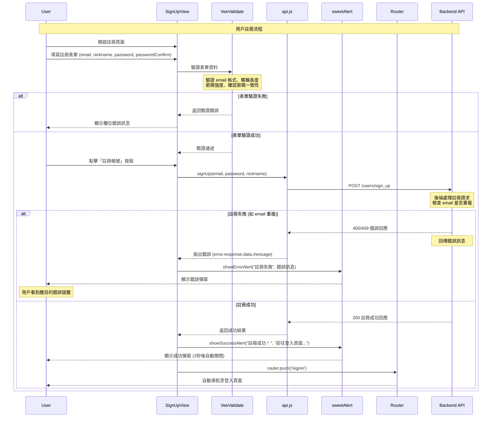
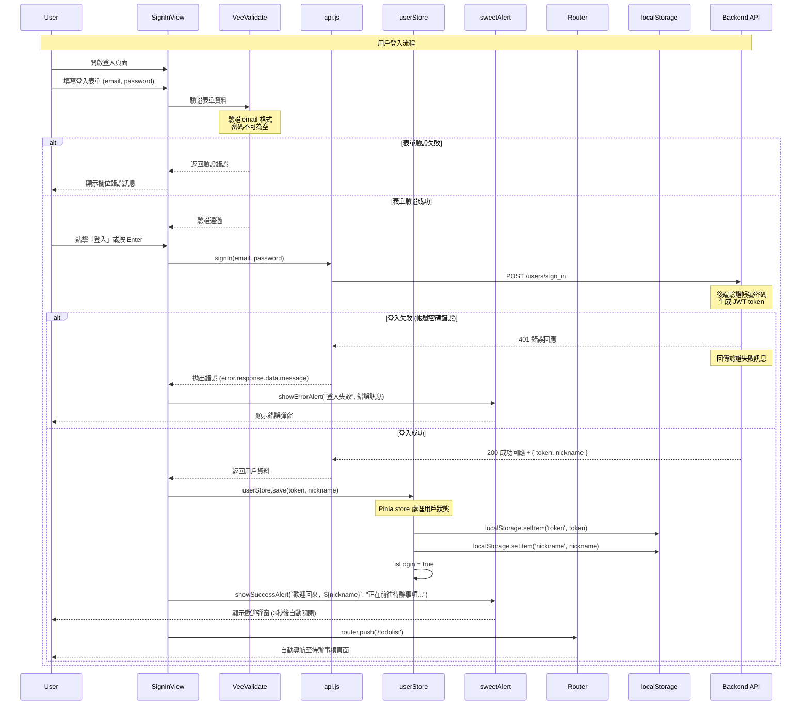
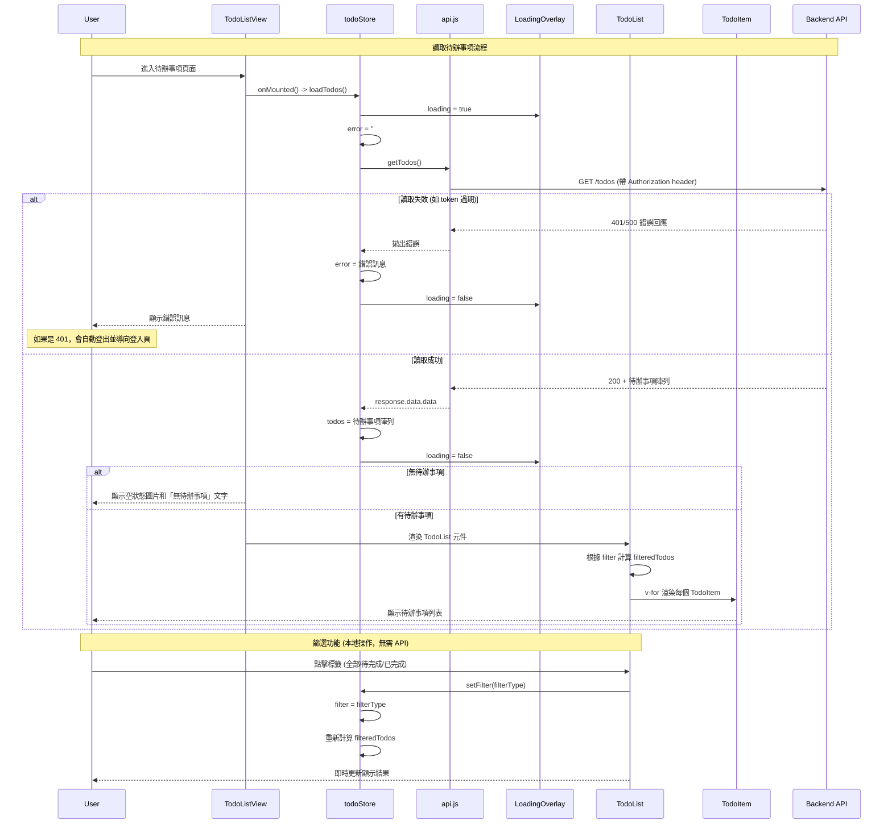
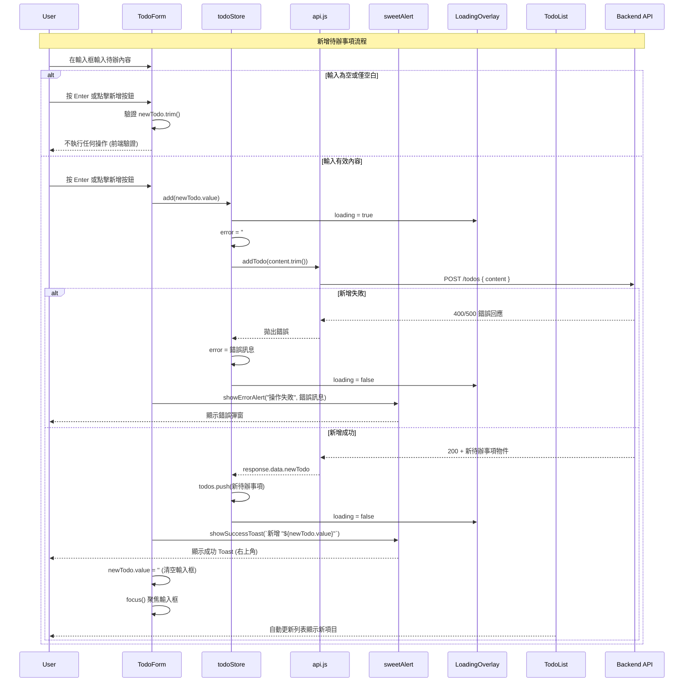
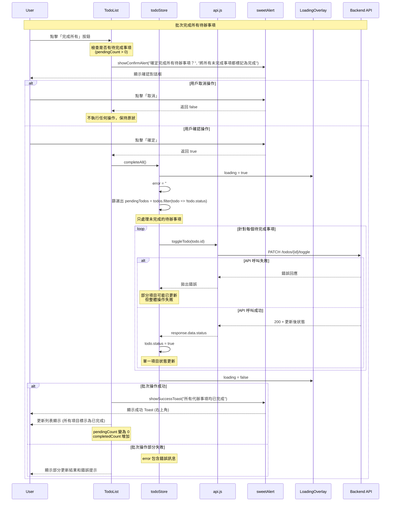
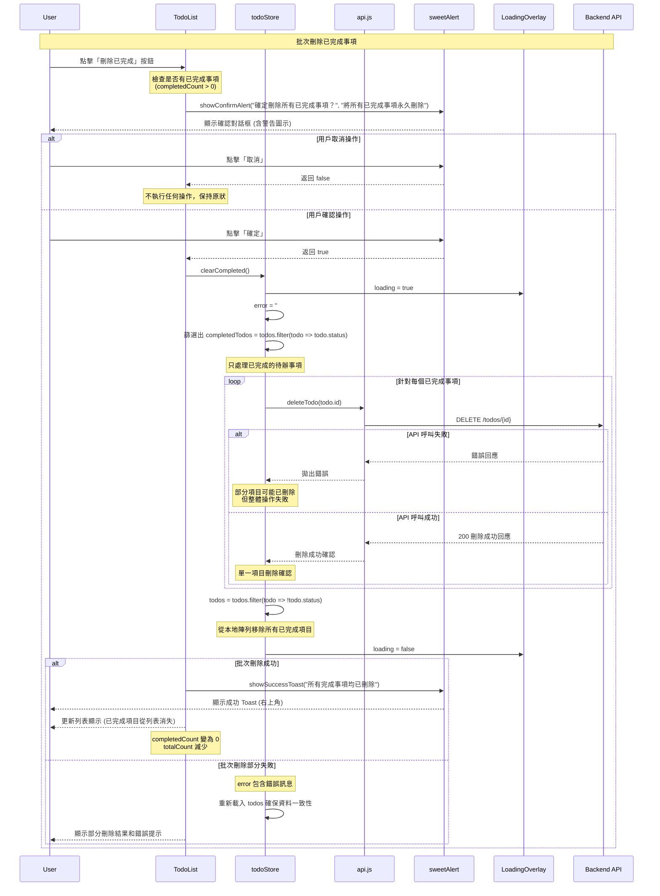

# 📝HexVueTodoList

- 六角學院 2025 Vue 新手營最終任務
- 包含基本與進階兩種等級，合併一起製作
- [Live Demo](https://dpi627.github.io/HexVueTodoList/) on GitHub Pages


# 📚 可用資源

- [Figma](https://www.figma.com/design/MFSk8P5jmmC2ns9V9YeCzM/TodoList?node-id=0-1&p=f)，提供靜態設計樣稿
- [CodePen](https://codepen.io/snijqlte-the-bold/pen/PwPxdde)，拆解好的頁面與 CSS 樣式
- [API](https://todolist-api.hexschool.io/doc/)，六角學院開放 RESTful API，串接使用
- [Notion](https://chalk-freedom-ec6.notion.site/2516ab47eb4880cab9f7d0d2e92c8607?pvs=74)，助教直播筆記

> [!NOTE]
> 另外助教有解題直播，建議觀看學習

# 🎯 任務必作項目

合併證書任務與串接 API 任務項目

- 需使用 Vue 框架並整合任務提供 API
- 需使用 Vue Router
- 新增待辦功能
- 移除待辦功能
- 待辦為無資料時，需顯示文字「目前尚無待辦事項」
- 切換待辦狀態 (打勾表示已完成、未勾表示待完成)
- 狀態頁籤切換功能 (全部、待完成、已完成)
- 確認待完成項目總數 (5 個待完成項目)
- 登入、註冊 API 功能
- 帳號重複註冊時， API 回傳錯誤，需醒目提醒用戶
- 結果統一部署到 GitHub Pages

## ✨額外完成項目

- 導入 `SweetAlert2` 顯示通知 (包含 Toast)
- 導入 `VeeValidate` `yup` 進行資料驗證
- 導入 `Pinia` 管理狀態 (待辦事項與使用者)
- 重新設計角色與相關圖示 (使用 `Nano Banana` 與 `Photopea`)
- 撰寫技術文件 `README.md`，並使用 AI 生成圖表
- 設計 404 頁面，並提供轉導回首頁功能
- 讀取元件與圖片預載，提供更好的操作體驗 (非必要項目，使用 AI 生成)
- 優化 CSS，支援高解析度，並調整待辦項目檢視設計，項目過多時出現卷軸

# 🏗️ 核心檔案架構

```txt
src/
├── App.vue       // 應用程式的根元件
├── main.js       // 應用入口，進行初始化與配置
├── assets/
│   └── main.css  // 全域 CSS (替換為模板 CSS)
├── components/
│   ├── LoadingOverlay.vue  // 顯示讀取狀態
│   ├── TodoForm.vue        // 待辦事項表單
│   ├── TodoItem.vue        // 單個待辦事項
│   └── TodoList.vue        // 待辦事項列表
├── router/
│   └── index.js  // 路由配置
├── stores/
│   ├── todo.js   // 待辦事項狀態管理
│   └── user.js   // 🤖 用戶狀態管理
├── utils/
│   ├── api.js    // 實作與後端 API 互動方法
│   ├── emoImageHelper.js // 🤖 處理圖片相關邏輯
│   ├── imagePreloader.js // 🤖 圖片預載提升體驗
│   └── sweetAlert.js     // 🤖 實作 SweetAlert 方法
└── views/
    ├── NotFoundView.vue  // 🤖 404 頁面
    ├── SignInView.vue    // 登入頁面
    ├── SignUpView.vue    // 註冊頁面
    └── TodoListView.vue  // 待辦事項列表
```

> [!WARNING]
> 標註 🤖 項目因與作業任務無直接關係，均使用 AI 輔助開發 + 人工修改

# 🚀 開發流程



# 📊 C4 Diagram

## 🌐 Context



## 📦 Container



# 🎨 角色重新設計

- 使用 Google AI Studio 製作
- Nano Banana 具備極高角色遵從性

## 🔄 保留原本設計元素


## 😊 各種表情圖示

|              確認/同意               |             錯誤/失敗              |              成功/完成               |
| :----------------------------------: | :--------------------------------: | :----------------------------------: |
|  |  |  |
|  |  |  |
|  |  |  |

## 🚫 404 Page



# 💡 補充技術知識

## 🛡️ 路由守衛

Vue Router 提供的導航守衛功能，可以在路由跳轉前後執行特定邏輯，常用於身份驗證、權限檢查等場景。

### 🔐 全域前置守衛

```javascript
// router/index.js
import { useUserStore } from '@/stores/user'

router.beforeEach((to, from, next) => {
  const userStore = useUserStore()

  // 需要登入的頁面
  if (to.meta.requiresAuth && !userStore.isLogin) {
    next('/signin')
  } else {
    next()
  }
})
```

### ⚙️ 路由設定

```javascript
const routes = [
  {
    path: '/todolist',
    name: 'TodoList',
    component: TodoListView,
    meta: { requiresAuth: true }, // 需要登入
  },
  {
    path: '/signin',
    name: 'SignIn',
    component: SignInView,
  },
]
```

## 🌐 Axios 攔截器

Axios 攔截器可以在請求發送前或響應回來後統一處理邏輯，例如添加認證 token、統一錯誤處理等。

### 📤 Request 攔截器

```javascript
// utils/api.js
import axios from 'axios'

// 請求攔截器：自動添加 token
api.interceptors.request.use(
  (config) => {
    const token = localStorage.getItem('token')
    if (token) {
      config.headers.Authorization = token
    }
    return config
  },
  (error) => Promise.reject(error),
)
```

### 📥 Response 攔截器

```javascript
// 響應攔截器：統一錯誤處理
api.interceptors.response.use(
  (response) => response,
  (error) => {
    if (error.response?.status === 401) {
      // token 過期，自動登出
      localStorage.removeItem('token')
      router.push('/signin')
    }
    return Promise.reject(error)
  },
)
```

## ✅ VeeValidate + yup

VeeValidate 是 Vue 的表單驗證庫，結合 yup 可以定義強大的驗證規則，提供即時表單驗證功能。

### 🚀 基本使用

```javascript
// 在 Vue 元件中
import { useForm } from 'vee-validate'
import * as yup from 'yup'

// 定義驗證規則
const schema = yup.object({
  email: yup.string().email('請輸入有效的 Email').required('Email 為必填'),
  password: yup.string().min(6, '密碼至少 6 個字元').required('密碼為必填'),
  passwordConfirm: yup
    .string()
    .oneOf([yup.ref('password')], '密碼確認不一致')
    .required('請確認密碼'),
})

// 使用表單驗證
const { handleSubmit, errors } = useForm({
  validationSchema: schema,
})
```

### 📄 模板中使用

```html
<template>
  <form @submit="onSubmit">
    <Field name="email" type="email" placeholder="請輸入 Email" />
    <ErrorMessage name="email" class="text-danger" />

    <Field name="password" type="password" placeholder="請輸入密碼" />
    <ErrorMessage name="password" class="text-danger" />

    <button type="submit">送出</button>
  </form>
</template>
```

## 🍍 Pinia

Pinia 是 Vue 3 的官方狀態管理庫，用來管理應用程式的全域狀態，比 Vuex 更輕量且更直觀。

### 🏪 定義 Store 範例

```javascript
// stores/user.js
import { defineStore } from 'pinia'

export const useUserStore = defineStore('user', {
  state: () => ({
    token: '',
    nickname: '',
    isLogin: false,
  }),

  actions: {
    save(token, nickname) {
      this.token = token
      this.nickname = nickname
      this.isLogin = true
      // 持久化到 localStorage
      localStorage.setItem('token', token)
      localStorage.setItem('nickname', nickname)
    },

    logout() {
      this.token = ''
      this.nickname = ''
      this.isLogin = false
      localStorage.removeItem('token')
      localStorage.removeItem('nickname')
    },
  },
})
```

### 🔗 在元件中使用 Store

```javascript
// 在 Vue 元件中
import { useUserStore } from '@/stores/user'

export default {
  setup() {
    const userStore = useUserStore()

    // 使用狀態
    console.log(userStore.isLogin)

    // 呼叫方法
    userStore.save('token123', 'John')

    return { userStore }
  },
}
```

## 📤 具名匯出與預設匯出

JavaScript ES6 模組系統提供兩種匯出方式：具名匯出 (Named Export) 和預設匯出 (Default Export)。

### 具名匯出範例

```javascript
// utils/api.js - 匯出多個函式
export const signIn = (email, password) => {
  /* ... */
}
export const signUp = (email, password, nickname) => {
  /* ... */
}
export const getTodos = () => {
  /* ... */
}

// 引入時需要使用相同名稱
import { signIn, signUp, getTodos } from '@/utils/api'
```

### 📋 預設匯出範例

```javascript
// utils/sweetAlert.js - 匯出一個主要物件
const sweetAlert = {
  showSuccessAlert: (title, text) => {
    /* ... */
  },
  showErrorAlert: (title, text) => {
    /* ... */
  },
  showConfirmAlert: (title, text) => {
    /* ... */
  },
}

export default sweetAlert

// 引入時可以自定義名稱
import sweetAlert from '@/utils/sweetAlert'
import swal from '@/utils/sweetAlert' // 也可以改名
```

### 🔀 混合使用範例

```javascript
// 同時使用具名匯出和預設匯出
export const API_BASE_URL = 'https://todolist-api.hexschool.io'
export { signIn, signUp } // 具名匯出

const api = axios.create({ baseURL: API_BASE_URL })
export default api // 預設匯出
```

## 🎯 解構賦值

ES6 解構賦值語法可以從陣列或物件中快速提取值，讓程式碼更簡潔易讀。

### 📦 物件解構範例

```javascript
// 從 API 回應中解構資料
const response = {
  data: {
    token: 'abc123',
    nickname: 'John',
    message: '登入成功',
  },
}

// 傳統寫法
const token = response.data.token
const nickname = response.data.nickname

// 解構寫法
const { token, nickname } = response.data

// 巢狀解構
const {
  data: { token, nickname },
} = response
```

### 🎯 陣列解構範例

```javascript
// 從陣列中解構值
const todos = ['買牛奶', '寫程式', '運動']

// 傳統寫法
const first = todos[0]
const second = todos[1]

// 解構寫法
const [first, second, third] = todos
const [firstTodo, ...restTodos] = todos // 使用展開運算子
```

### ⚡ 函式參數解構範例

```javascript
// 在函式參數中直接解構
const createUser = ({ email, password, nickname }) => {
  // 直接使用 email, password, nickname
  return api.post('/users/sign_up', { email, password, nickname })
}

// 呼叫時傳入物件
createUser({
  email: 'test@example.com',
  password: '123456',
  nickname: 'John',
})
```

## 🔧 `/utils` 之 `*.js` 撰寫方法

Utils 模組是將共用功能封裝成獨立模組的最佳實踐，提高程式碼的可重用性和維護性。

### 🎯 單一職責原則範例

```javascript
// utils/api.js - 專門處理 API 請求
import axios from 'axios'

const API_BASE_URL = import.meta.env.VITE_API_URL
const api = axios.create({ baseURL: API_BASE_URL })

// 統一的錯誤處理
const handleApiError = (error) => {
  const message = error.response?.data?.message || '發生未知錯誤'
  throw new Error(message)
}

// 匯出具體的 API 函式
export const signIn = async (email, password) => {
  try {
    const response = await api.post('/users/sign_in', { email, password })
    return response.data
  } catch (error) {
    handleApiError(error)
  }
}

export const getTodos = async () => {
  try {
    const response = await api.get('/todos')
    return response.data
  } catch (error) {
    handleApiError(error)
  }
}
```

### 🔧 工具函式封裝範例

```javascript
// utils/imagePreloader.js - 圖片預載工具
export const preloadImages = (imageUrls) => {
  return Promise.all(
    imageUrls.map((url) => {
      return new Promise((resolve, reject) => {
        const img = new Image()
        img.onload = () => resolve(url)
        img.onerror = () => reject(new Error(`Failed to load ${url}`))
        img.src = url
      })
    }),
  )
}

// 使用範例
const imageUrls = ['/img/success-1.jpeg', '/img/error-1.jpeg']
preloadImages(imageUrls)
  .then(() => console.log('所有圖片已預載完成'))
  .catch((error) => console.error('圖片預載失敗:', error))
```

### ⚙️ 配置物件模式範例

```javascript
// utils/sweetAlert.js - SweetAlert 配置封裝
import Swal from 'sweetalert2'

const defaultConfig = {
  confirmButtonColor: '#198754',
  cancelButtonColor: '#6c757d',
  timer: 3000,
  showConfirmButton: false,
}

export const showSuccessToast = (title, text = '') => {
  return Swal.fire({
    ...defaultConfig,
    icon: 'success',
    title,
    text,
    toast: true,
    position: 'top-end',
  })
}

export const showConfirmAlert = (title, text) => {
  return Swal.fire({
    title,
    text,
    icon: 'question',
    showCancelButton: true,
    confirmButtonText: '確定',
    cancelButtonText: '取消',
  })
}
```

## 🌍 環境變數 `.env`

環境變數用來管理不同環境下的配置設定，避免將敏感資訊或環境相關設定寫死在程式碼中。

### ⚡ Vite 環境變數設定

```bash
# .env.local (本地開發環境)
VITE_API_URL=https://todolist-api.hexschool.io
VITE_APP_TITLE=HexVueTodoList (開發版)
VITE_DEBUG_MODE=true

# .env.production (正式環境)
VITE_API_URL=https://todolist-api.hexschool.io
VITE_APP_TITLE=HexVueTodoList
VITE_DEBUG_MODE=false
```

### 💻 在程式碼中使用環境變數

```javascript
// vite.config.js - 建構配置
export default defineConfig({
  // 使用環境變數設定基礎路徑
  base: import.meta.env.VITE_BASE_URL || '/',

  // 開發伺服器配置
  server: {
    port: import.meta.env.VITE_DEV_PORT || 5173,
  },
})

// utils/api.js - API 基礎 URL
const API_BASE_URL = import.meta.env.VITE_API_URL || 'http://localhost:3000'

// main.js - 應用程式標題
document.title = import.meta.env.VITE_APP_TITLE || 'Vue App'

// 除錯模式判斷
if (import.meta.env.VITE_DEBUG_MODE === 'true') {
  console.log('Debug mode enabled')
}
```

### 🌟 環境變數最佳實踐

```javascript
// utils/config.js - 集中管理環境變數
export const config = {
  apiUrl: import.meta.env.VITE_API_URL,
  appTitle: import.meta.env.VITE_APP_TITLE,
  isDebugMode: import.meta.env.VITE_DEBUG_MODE === 'true',

  // 提供預設值
  timeout: Number(import.meta.env.VITE_TIMEOUT) || 5000,

  // 驗證必要環境變數
  validate() {
    if (!this.apiUrl) {
      throw new Error('VITE_API_URL is required')
    }
  },
}

// 在應用啟動時驗證
config.validate()
```

# 🔄 資料流程 (循序圖)

## 👤 使用者註冊



## 🔑 使用者登入



## 📝 待辦事項管理

### ➕ 新增事項



### 📖 讀取事項



### ✅ 批次完成



### 🗑️ 批次刪除


